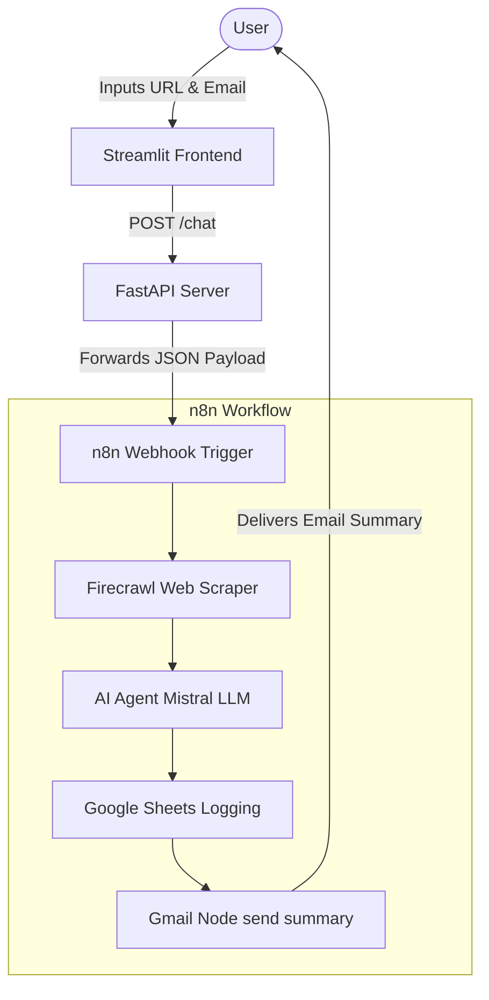

# 🤖 AI Page Summarizer & Insights Emailer

A clean, modern, and beginner-friendly full-stack application that takes any web page URL and a recipient's email address, automatically scrapes the webpage, generates an AI summary and key insights, logs the execution details in a Google Sheet, and emails the results directly to the user's inbox using an **n8n automation workflow**.

---

## 📐 Project Architecture & Flow

Here is how the data flows through the application:



1. **Frontend**: The user inputs a webpage URL and their email address into a sleek **Streamlit** dashboard.
2. **Backend**: A **FastAPI** server validates inputs, handles formatting fallbacks, and forwards the data to your n8n webhook.
3. **n8n Webhook**: Triggers your automation pipeline:
   - Scrapes the web page content using **Firecrawl**.
   - Sends the scraped text to a **Mistral Cloud Chat Model (AI Agent)** to generate summaries and insights.
   - Logs the summary, insights, and user session to a **Google Sheet**.
   - Sends the summary to the user's **Gmail** address.

---

## 📂 Project Directory Structure

```text
├── backend/
│   ├── main.py              # FastAPI server file (routes requests & handles timeout configs)
│   └── requirements.txt     # Python packages needed for backend (FastAPI, uvicorn, etc.)
├── frontend/
│   ├── chat_app.py          # Streamlit UI file (chat workspace & custom sidebar form)
│   └── requirements.txt     # Python packages needed for frontend (Streamlit, requests)
├── .env                     # Configuration file for ports, host, and your n8n Webhook URL
├── start.sh                 # Executable launcher script (runs backend + frontend together)
└── README.md                # This documentation file
```

---

## 🛠️ Tech Stack

* **Frontend**: [Streamlit](https://streamlit.io/) (for building rapid, clean interactive Python UIs)
* **Backend**: [FastAPI](https://fastapi.tiangolo.com/) (modern, high-performance web API framework) & [Uvicorn](https://www.uvicorn.org/) (server engine)
* **Automation**: [n8n](https://n8n.io/) (node-based workflow automation engine)
* **Scraper**: [Firecrawl](https://www.firecrawl.dev/) (advanced web scraping API)
* **AI Model**: Mistral Cloud LLM

---

## ⚙️ Configuration Setup

Before running the application, make sure your `.env` file in the root directory is configured with your active n8n webhook URL.

Open your **`.env`** file and configure it like this:

```env
# Your unique n8n workflow webhook trigger URL
WEBHOOK_URL=https://your-n8n-subdomain.app.n8n.cloud/webhook/your-webhook-id

# API Backend Configuration
API_PORT=8005
BACKEND_HOST=0.0.0.0
```

---

## 🚀 Running the Project

You can run this project using two methods: the **Easy Launch Script** or the **Manual Step-by-Step** method.

### Method 1: The Easy Launch Script (Recommended)
We have provided an executable helper script `start.sh` that automatically activates the Python environment, runs the backend, and launches the Streamlit frontend.

In your terminal, navigate to the root directory and run:
```bash
./start.sh
```
* **Stopping**: To close both servers at the same time, press `CTRL + C` in the terminal.

---

### Method 2: Manual Terminal Startup
If you want to run backend and frontend separately in two terminal tabs:

**Tab 1: Start the FastAPI Backend**
```bash
source venv/bin/activate
python backend/main.py
```
*Your backend will run on [http://localhost:8005](http://localhost:8005)*

**Tab 2: Start the Streamlit Frontend**
```bash
source venv/bin/activate
streamlit run frontend/chat_app.py
```
*Your frontend will automatically open on [http://localhost:8501](http://localhost:8501)*

---

## 💡 Crucial n8n Configuration Rules

To ensure that the workflow communicates perfectly with the UI:

1. **Webhook JSON Format**:
   The webhook trigger node expects the following JSON body structure:
   ```json
   {
     "session_id": "test-001",
     "email": "user@example.com",
     "article_url": "https://example.com/article"
   }
   ```
   Both the backend and frontend are already programmed to package the data into this format.

2. **Wait for Workflow Completion (Response Mode)**:
   By default, n8n replies with `{"message": "Workflow was started"}` immediately, without waiting for the results. To display the actual confirmation or summary in the Streamlit chat:
   * Open your **Webhook Trigger Node** in n8n.
   * Locate the **Response Mode** (or **Respond**) setting.
   * Change it from **On Received** to **When Last Node Finishes** (or use a **Respond to Webhook** node at the end of the workflow).
